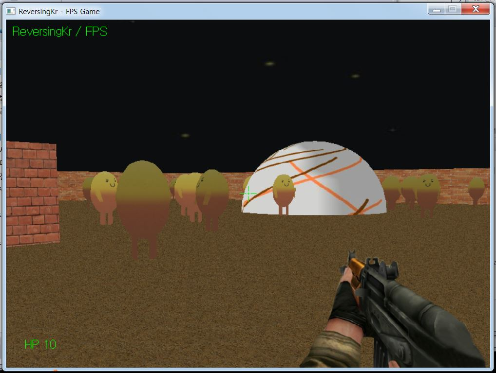
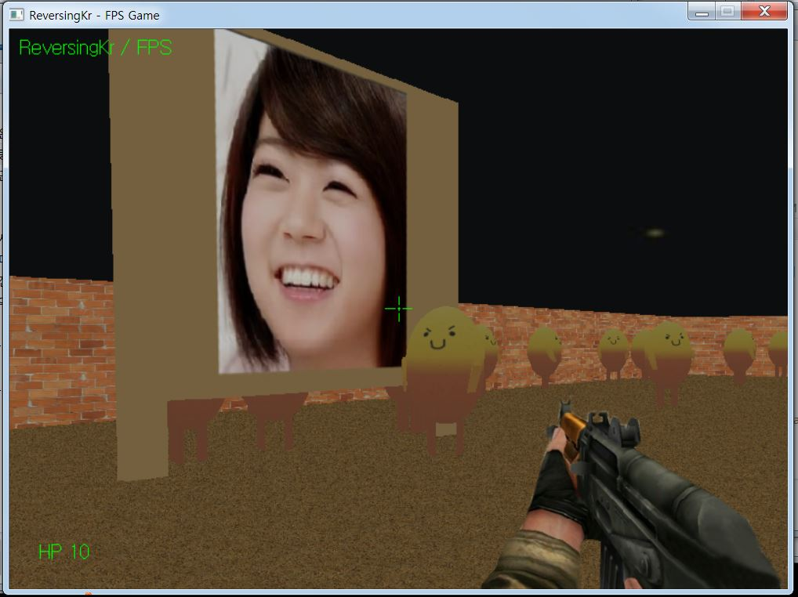
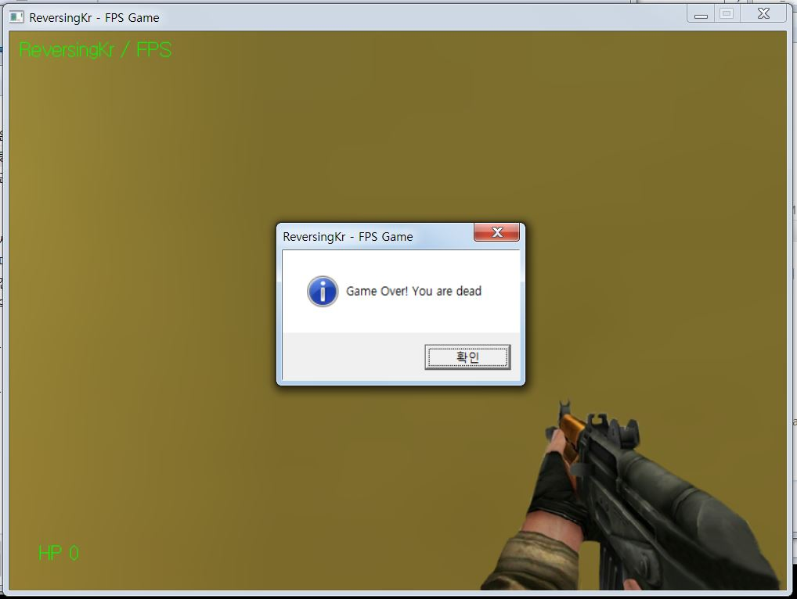
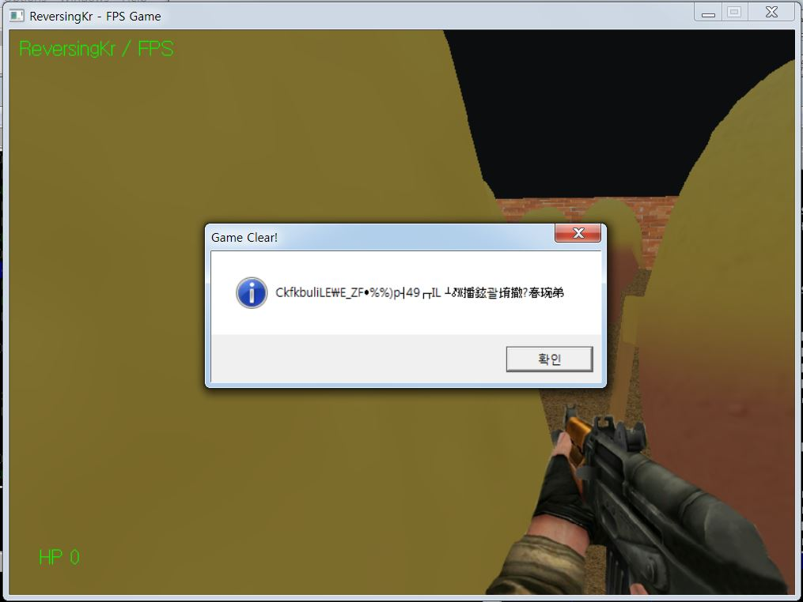

# [reversing.kr] Direct3D FPS writeup


완전완전쓰 기대하던 문제다. 

3D 그래픽을 이용해서 만든 프로그램은 어떻게 되어있을까 굉장히 궁금했는데, 크게 다를 바는 없는 것 같다.

아무튼 매번 하던 단순한 텍스트 박스와는 다르게 실제 FPS 게임같은 느낌이 나서 굉장히 재미있게 풀었다.

사실 문제는 대충 어떻게 어떻게 풀긴 했지만, 코드 분석을 끝까지는 하지 못했다. 생각보다 크게 어렵지는 않아서 일단 풀이쓰고 나중에 더 해가야겠다. 3D 프로그래밍을 배워서 나도 이런거 만들어보고 싶다.


암튼 게임 실행화면은 다음과 같다.





(한승연 예쁘다)



몬스터를 총으로 쏴서 없앨 수 있고, 몬스터에 닿으면 죽는다.


클리어 조건이 뭔지는 잘 모르겠는데, 일단 해당 바이너리 내에 존재하는 문자열들을 찾아보자.

```assembly
.rdata:00F95568 00000018 C Game Over! You are dead
.rdata:00F955B0 0000000C C Game Clear!
```

여러가지 문자열이 있지만, 일단 `"Game Over! You are dead"`와 `"Game Clear!"`라는 문자열이 보인다.

`"Game Over!"` 문자열에 접근하는 코드는 다음과 같고,

```c
      if ( GetActiveWindow() == hWnd )
      {
        if ( HP <= 0 )
        {
          MessageBoxA(hWnd, "Game Over! You are dead", "ReversingKr - FPS Game", 0x40u);
          v7(1);
          SendMessageA(hWnd, 2u, 0, 0);
        }
        success_routine();
        sub_F914A0(0.001);
        sub_F91610(1.0);
```


`"Game Clear!"` 문자열에 접근하는 코드를 보면 다음과 같다.

```c
int *success_routine()
{
  int *result; // eax@1

  result = dword_F99194;
  while ( *result != 1 )
  {
    result += 132;
    if ( (signed int)result >= (signed int)&unk_F9F8B4 )
    {
      MessageBoxA(hWnd, &flag, "Game Clear!", 0x40u);
      return (int *)SendMessageA(hWnd, 2u, 0, 0);
    }
  }
  return result;
}
```

적당히 `"Game Clear!"`를 표시해주는 메세지 박스를 호출해주는 함수인데, 디버거 상에서 EIP를 조작해서 해당 함수를 실행하도록 하면 다음과 같은 메세지 박스를 볼 수 있다.



저 이상한 문자열이 특별한 작업을 거치면 플래그가 된다라는 킹리적추론을 할 수 있다.

저 문자열의 위치는 클리어 메세지 박스에서 두 번째 인자에 존재한다. 어떤 작업을 거치는지 찾기위해 해당 위치에 접근하는 다른 코드를 찾아보도록 하자.

ollydbg에서 xref 기능을 찾아보다가 못 찾겠어서 여기서부터는 그냥 IDA로 분석했다.

xref 기능을 사용하면 다행히 위 코드 외에, 다음의 코드에서만이 해당 주소에 접근함을 알 수 있다.

```c
int __thiscall shooting(void *this)
{
  int result; // eax@1
  int v2; // ecx@2
  int monsterHp; // edx@2

  result = toMonster(this);
  if ( result != -1 )
  {
    v2 = 0x84 * result;
    monsterHp = monster[0x84 * result];
    if ( monsterHp > 0 )
    {
      monster[v2] = monsterHp - 2;
    }
    else
    {
      dword_1029194[v2] = 0;
      *((_BYTE *)&flag + result) ^= target[v2 * 4]; // target[result*0x210]
    }
  }
  return result;
}
```

분석한 결과대로 대충 이름지어 보았다. 이 함수는 일단 마우스를 클릭해서 총을 쏘는 동작을 하면 실행되는 함수이고, 저 toMonster 이라는 함수는 자세하게 분석하지는 않았는데, 몬스터에게 쐈을 때 해당 몬스터의 인식번호(?)를 리턴해주는 역할을 수행하는 것 같다.

아무튼 메모리에 존재하는 해당 몬스터의 HP(처음 0x64)를 총알 한 방당 2씩 깍아주고, 몬스터의 HP가 0이 되었을 경우 아까 구했던 해당 몬스터의 인식번호(?)를 인덱스로 활용하여 flag와 target이라는 어떤 메모리 공간에 있는 값과 XOR 연산을 수행하여 flag를 업데이트 시켜준다.


이제 IDA에서 동적디버깅을 켜고 해당하는 메모리 값들을 읽어와서 연산해주면 된다. flag의 주소는 0xc77028이었고, target의 주소는 0xc79184였다. IDAPython 기능을 이용하면 쉽게 할 수 있다. 찾아보니까 `Byte()`와  `GetManyBytes()`를 이용하면 메모리 내의 값을 읽어올 수 있더라. 대충 0x64번으로 돌렸다.

수식 : `*((_BYTE *)&byte_C77028 + result) ^= byte_C79184[ 0x84 * result * 4];`

flag :

```shell
00C7701B  FF 01 00 00 00 0A 00 00  00 1C 52 C7 00 43 6B 66  ..........R..Ckf
00C7702B  6B 62 75 6C 69 4C 45 5C  45 5F 5A 46 1C 07 25 25  kbuliLE\E_ZF..%%
00C7703B  29 70 17 34 39 01 16 49  4C 20 15 0B 0F F7 EB FA  )p.49..IL ......
00C7704B  E8 B0 FD EB BC F4 CC DA  9F F5 F0 E8 CE F0 A9 00  ................
00C7705B  00 00 00 00 00 60 00 8C  00 10 23 43 03 E8 3F 68  .....`....#C..?h
```

code :

```shell
Python> result = ''
Python> array = GetManyBytes(0xC77028, 0x64)
Python> for i in range(0x64): result += chr(ord(array[i]) ^ ord(Byte(0xC79184 + 0x84*4*i)))
Python> print result
Congratulation~ Game Clear! Password is Thr3EDPr0m
```


[+] 다른 사람들의 풀이를 찾아보니 저 target 값에 대해 서술한 부분이 있어 나도 올리디버거로 target 메모리에 하드웨어 포인트를 걸어 확인해보았다.

```assembly
01022C54  |> /A1 647D0201   /MOV EAX,[1027D64]
01022C59  |> |68 94530201    PUSH FPS.01025394                       ; /Arg2 = 01025394 ASCII "data\Gogooma.x"
01022C5E  |. |56            |PUSH ESI                                ; |Arg1
01022C5F  |. |8906          |MOV [ESI],EAX                           ; |
01022C61  |. |E8 FAF1FFFF   |CALL FPS.01021E60                       ; \FPS.011F1E60
01022C66  |. |85C0          |TEST EAX,EAX
01022C68  |. |0F84 33010000 |JE FPS.01022DA1
01022C6E  |. |8BC6          |MOV EAX,ESI
01022C70  |. |E8 1BF7FFFF   |CALL FPS.01022390
01022C75  |. |8AC3          |MOV AL,BL
01022C77  |. |02C0          |ADD AL,AL
01022C79  |. |02C0          |ADD AL,AL
01022C7B  |. |8886 F4010000 |MOV [ESI+1F4],AL
01022C81  |. |81C6 10020000 |ADD ESI,210
01022C87  |. |43            |INC EBX
01022C88  |. |81FE B0F60201 |CMP ESI,FPS.0102F6B0
01022C8E  |.^\7C C4         \JL SHORT FPS.01022C54
```

IDA로 보니 main 문에서 고구마를 로드하는 중간에 위치해 있었다. 결국 저 target을 이용하여 접근하는 배열은 0부터 시작해서 4씩 더해나가는 배열인 걸 알 수 있다.

```c
 while ( 1 )
  {
    *(_DWORD *)v6 = v4;
    if ( !sub_1021E60(v6, "data\\Gogooma.x") )
    {
      v18 = "ReversingKr - FPS Game";
      v17 = (const CHAR *)&unk_10253A4;
      goto LABEL_72;
    }
    sub_1022390((int)v6);
    *((_BYTE *)v6 + 0x1F4) = 4 * v5;  <= 여기
    v6 = (char *)v6 + 0x210;          <= 여기
    ++v5;
    if ( (signed int)v6 >= (signed int)&flt_102F6B0 )
      break;
    v4 = dword_1027D64;
  }
```

내가 풀었던 것처럼 디버깅 중 메모리에 저장된 값을 읽어와서 XOR 연산해도 되고, 해당 복호화 알고리즘을 알았으니 그냥 원래 있던 저 flag 값을 0, 4, 8, ... 에 해당하는 값들과 XOR 연산해서 구해도 된다.